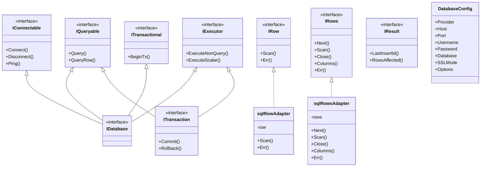

# 1.2 API Design Principles

## SOLID Principles Applied to APIs


### Single Responsibility Principle (SRP)
1. **API Endpoints**
   - Each endpoint should handle one specific business capability
   - Avoid combining multiple unrelated operations
   - Example: Separate user profile and user orders endpoints

2. **Resource Design**
   - Resources should represent single business entities
   - Avoid mixing concerns within resources
   - Clear separation of resource responsibilities

3. **Implementation Guidelines**
   ```sh
   Good:
   /users/{id}/profile
   /users/{id}/orders
   
   Bad:
   /users/{id}/profile-and-orders
   ```
   #### Typescript
   ```typescript
   
   // types.ts
   interface User {
   id: string;
   name: string;
   email: string;
   }

   interface Profile {
   bio: string;
   location: string;
   avatarUrl: string;
   }

   interface Order {
   id: string;
   userId: string;
   amount: number;
   status: 'pending' | 'completed' | 'cancelled';
   createdAt: Date;
   }

   // routes/users.ts
   import express from 'express';
   import { Router } from 'express';

   const router = Router();

   // Good: Separate endpoints for different resources
   router.get('/users/:id/profile', async (req: express.Request, res: express.Response) => {
   try {
      const userId = req.params.id;
      const profile = await ProfileService.getByUserId(userId);
      res.json(profile);
   } catch (error) {
      res.status(500).json({ error: 'Failed to fetch profile' });
   }
   });

   router.get('/users/:id/orders', async (req: express.Request, res: express.Response) => {
   try {
      const userId = req.params.id;
      const orders = await OrderService.getByUserId(userId);
      res.json(orders);
   } catch (error) {
      res.status(500).json({ error: 'Failed to fetch orders' });
   }
   });

   // Bad: Combined endpoint that violates separation of concerns
   router.get('/users/:id/profile-and-orders', async (req: express.Request, res: express.Response) => {
   try {
      const userId = req.params.id;
      const [profile, orders] = await Promise.all([
         ProfileService.getByUserId(userId),
         OrderService.getByUserId(userId)
      ]);
      res.json({ profile, orders }); // Tightly couples different resources
   } catch (error) {
      res.status(500).json({ error: 'Failed to fetch profile and orders' });
   }
   });

   export default router;
   ```

   #### Golang
   ```go
   // models/models.go
   package models

   type User struct {
      ID    string `json:"id"`
      Name  string `json:"name"`
      Email string `json:"email"`
   }

   type Profile struct {
      UserID    string `json:"userId"`
      Bio       string `json:"bio"`
      Location  string `json:"location"`
      AvatarURL string `json:"avatarUrl"`
   }

   type Order struct {
      ID        string    `json:"id"`
      UserID    string    `json:"userId"`
      Amount    float64   `json:"amount"`
      Status    string    `json:"status"`
      CreatedAt time.Time `json:"createdAt"`
   }

   // handlers/users.go
   package handlers

   import (
      "net/http"
      "github.com/gorilla/mux"
   )

   // Good: Separate handlers for different resources
   func GetUserProfile(w http.ResponseWriter, r *http.Request) {
      vars := mux.Vars(r)
      userID := vars["id"]
      
      profile, err := services.GetProfileByUserID(userID)
      if err != nil {
         http.Error(w, "Failed to fetch profile", http.StatusInternalServerError)
         return
      }
      
      json.NewEncoder(w).Encode(profile)
   }

   func GetUserOrders(w http.ResponseWriter, r *http.Request) {
      vars := mux.Vars(r)
      userID := vars["id"]
      
      orders, err := services.GetOrdersByUserID(userID)
      if err != nil {
         http.Error(w, "Failed to fetch orders", http.StatusInternalServerError)
         return
      }
      
      json.NewEncoder(w).Encode(orders)
   }

   // Bad: Combined handler that violates separation of concerns
   func GetUserProfileAndOrders(w http.ResponseWriter, r *http.Request) {
      vars := mux.Vars(r)
      userID := vars["id"]
      
      profile, err := services.GetProfileByUserID(userID)
      if err != nil {
         http.Error(w, "Failed to fetch profile", http.StatusInternalServerError)
         return
      }
      
      orders, err := services.GetOrdersByUserID(userID)
      if err != nil {
         http.Error(w, "Failed to fetch orders", http.StatusInternalServerError)
         return
      }
      
      // Tightly couples different resources
      response := struct {
         Profile Profile `json:"profile"`
         Orders  []Order `json:"orders"`
      }{
         Profile: profile,
         Orders:  orders,
      }
      
      json.NewEncoder(w).Encode(response)
   }

   // main.go
   func main() {
      router := mux.NewRouter()
      
      // Good: Register separate endpoints
      router.HandleFunc("/users/{id}/profile", handlers.GetUserProfile).Methods("GET")
      router.HandleFunc("/users/{id}/orders", handlers.GetUserOrders).Methods("GET")
      
      // Bad: Combined endpoint
      router.HandleFunc("/users/{id}/profile-and-orders", handlers.GetUserProfileAndOrders).Methods("GET")
      
      http.ListenAndServe(":8080", router)
   }
   ```

### Open/Closed Principle (OCP)
1. **API Extension**
   - Design for extensibility without modifying existing endpoints
   - Use versioning to introduce breaking changes
   - Support optional parameters and fields

2. **Implementation Strategies**
   - Query parameters for optional functionality
   - Response envelopes for extensible responses
   - Custom headers for additional features

3. **Practical Examples**
   ```sh
   Extensible:
   GET /api/v1/users?include=orders,preferences
   
   Version-based:
   GET /api/v2/users (new features)
   GET /api/v1/users (maintains backward compatibility)
   ```
   #### Type Script
   ```typescript
   // types.ts
   interface BaseUser {
      id: string;
      email: string;
      name: string;
   }

   interface Order {
      id: string;
      amount: number;
      status: string;
   }

   interface Preferences {
      theme: string;
      notifications: boolean;
      language: string;
   }

   // v2 adds new fields
   interface UserV2 extends BaseUser {
      phoneNumber?: string;
      twoFactorEnabled: boolean;
   }

   // services/user.service.ts
   class UserService {
   private async getBaseUser(id: string): Promise<BaseUser> {
      // Fetch base user data
      return {} as BaseUser;
   }

   private async getOrders(userId: string): Promise<Order[]> {
      // Fetch orders
      return [] as Order[];
   }

   private async getPreferences(userId: string): Promise<Preferences> {
      // Fetch preferences
      return {} as Preferences;
   }

   // Extensible approach using includes
   async getUserWithIncludes(
      id: string,
      includes: string[]
   ): Promise<Record<string, any>> {
      const result: Record<string, any> = {
         user: await this.getBaseUser(id),
      };

      const includeSet = new Set(includes);

      if (includeSet.has('orders')) {
         result.orders = await this.getOrders(id);
      }

      if (includeSet.has('preferences')) {
         result.preferences = await this.getPreferences(id);
      }

      return result;
   }
   }

   // controllers/user.controller.ts
   import { Router } from 'express';
   const router = Router();
   const userService = new UserService();

   // Approach 1: Extensible using query parameters
   router.get('/api/v1/users/:id', async (req, res) => {
   try {
      const { id } = req.params;
      const includes = (req.query.include as string || '')
         .split(',')
         .filter(Boolean);

      const result = await userService.getUserWithIncludes(id, includes);
      res.json(result);
   } catch (error) {
      res.status(500).json({ error: 'Failed to fetch user data' });
   }
   });

   // Approach 2: Version-based
   // V1 API maintains original behavior
   router.get('/api/v1/users/:id', async (req, res) => {
   try {
      const { id } = req.params;
      const baseUser = await userService.getUserWithIncludes(id, []);
      res.json(baseUser);
   } catch (error) {
      res.status(500).json({ error: 'Failed to fetch user data' });
   }
   });

   // V2 API adds new features
   router.get('/api/v2/users/:id', async (req, res) => {
   try {
      const { id } = req.params;
      const baseUser = await userService.getUserWithIncludes(id, []);
      const userV2: UserV2 = {
         ...baseUser.user,
         phoneNumber: '123-456-7890', // New field in V2
         twoFactorEnabled: true,      // New field in V2
      };
      res.json(userV2);
   } catch (error) {
      res.status(500).json({ error: 'Failed to fetch user data' });
   }
   });
   ```
   #### Golang
   ```go
   package main

   import (
      "encoding/json"
      "net/http"
      "strings"
      "github.com/gorilla/mux"
   )

   // Models
   type BaseUser struct {
      ID    string `json:"id"`
      Email string `json:"email"`
      Name  string `json:"name"`
   }

   type UserV2 struct {
      BaseUser
      PhoneNumber      string `json:"phoneNumber,omitempty"`
      TwoFactorEnabled bool   `json:"twoFactorEnabled"`
   }

   type Order struct {
      ID     string  `json:"id"`
      Amount float64 `json:"amount"`
      Status string  `json:"status"`
   }

   type Preferences struct {
      Theme         string `json:"theme"`
      Notifications bool   `json:"notifications"`
      Language      string `json:"language"`
   }

   // Services
   type UserService struct{}

   func (s *UserService) GetBaseUser(id string) (*BaseUser, error) {
      // Fetch base user data
      return &BaseUser{}, nil
   }

   func (s *UserService) GetOrders(userID string) ([]Order, error) {
      // Fetch orders
      return []Order{}, nil
   }

   func (s *UserService) GetPreferences(userID string) (*Preferences, error) {
      // Fetch preferences
      return &Preferences{}, nil
   }

   // Response builder using the builder pattern
   type UserResponseBuilder struct {
      data map[string]interface{}
   }

   func NewUserResponseBuilder(user *BaseUser) *UserResponseBuilder {
      return &UserResponseBuilder{
         data: map[string]interface{}{
               "user": user,
         },
      }
   }

   func (b *UserResponseBuilder) WithOrders(orders []Order) *UserResponseBuilder {
      b.data["orders"] = orders
      return b
   }

   func (b *UserResponseBuilder) WithPreferences(prefs *Preferences) *UserResponseBuilder {
      b.data["preferences"] = prefs
      return b
   }

   func (b *UserResponseBuilder) Build() map[string]interface{} {
      return b.data
   }

   // Handlers
   type UserHandler struct {
      service *UserService
   }

   // Approach 1: Extensible using query parameters
   func (h *UserHandler) GetUserWithIncludes(w http.ResponseWriter, r *http.Request) {
      vars := mux.Vars(r)
      userID := vars["id"]
      
      includes := strings.Split(r.URL.Query().Get("include"), ",")
      includeSet := make(map[string]bool)
      for _, include := range includes {
         if include != "" {
               includeSet[include] = true
         }
      }
      
      user, err := h.service.GetBaseUser(userID)
      if err != nil {
         http.Error(w, "Failed to fetch user", http.StatusInternalServerError)
         return
      }
      
      builder := NewUserResponseBuilder(user)
      
      if includeSet["orders"] {
         orders, err := h.service.GetOrders(userID)
         if err == nil {
               builder.WithOrders(orders)
         }
      }
      
      if includeSet["preferences"] {
         prefs, err := h.service.GetPreferences(userID)
         if err == nil {
               builder.WithPreferences(prefs)
         }
      }
      
      json.NewEncoder(w).Encode(builder.Build())
   }

   // Approach 2: Version-based API
   // V1 API - Original version
   func (h *UserHandler) GetUserV1(w http.ResponseWriter, r *http.Request) {
      vars := mux.Vars(r)
      userID := vars["id"]
      
      user, err := h.service.GetBaseUser(userID)
      if err != nil {
         http.Error(w, "Failed to fetch user", http.StatusInternalServerError)
         return
      }
      
      json.NewEncoder(w).Encode(user)
   }

   // V2 API - New version with additional fields
   func (h *UserHandler) GetUserV2(w http.ResponseWriter, r *http.Request) {
      vars := mux.Vars(r)
      userID := vars["id"]
      
      baseUser, err := h.service.GetBaseUser(userID)
      if err != nil {
         http.Error(w, "Failed to fetch user", http.StatusInternalServerError)
         return
      }
      
      // Extend with V2 fields
      userV2 := UserV2{
         BaseUser:        *baseUser,
         PhoneNumber:     "123-456-7890",
         TwoFactorEnabled: true,
      }
      
      json.NewEncoder(w).Encode(userV2)
   }

   func main() {
      router := mux.NewRouter()
      handler := &UserHandler{service: &UserService{}}
      
      // Approach 1: Extensible endpoint
      router.HandleFunc("/api/v1/users/{id}", handler.GetUserWithIncludes).
         Methods("GET").
         Queries("include", "{include}")
      
      // Approach 2: Versioned endpoints
      router.HandleFunc("/api/v1/users/{id}", handler.GetUserV1).Methods("GET")
      router.HandleFunc("/api/v2/users/{id}", handler.GetUserV2).Methods("GET")
      
      http.ListenAndServe(":8080", router)
   }
   ```

### Liskov Substitution Principle (LSP)
1. **Resource Inheritance**
   - Subtypes must be substitutable for their base types
   - Maintain consistent behavior across resource variants
   - Preserve contract expectations

2. **Response Consistency**
   - Consistent error handling
   - Predictable response structures
   - Compatible data types

3. **Example Implementation**
   ```json
   Base Response:
   {
     "id": "string",
     "type": "string",
     "attributes": {}
   }

   Derived Responses must maintain this structure
   ```

   #### Type Script
   ```typescript
      // types/response.ts
      interface BaseResponse<T> {
         id: string;
         type: string;
         attributes: T;
      }

      // Attribute interfaces for different resources
      interface UserAttributes {
         email: string;
         name: string;
         createdAt: Date;
      }

      interface OrderAttributes {
         total: number;
         status: 'pending' | 'completed' | 'cancelled';
         items: number;
         orderedAt: Date;
      }

      interface ProductAttributes {
         name: string;
         price: number;
         stock: number;
         category: string;
      }

      // Response type aliases for better readability
      type UserResponse = BaseResponse<UserAttributes>;
      type OrderResponse = BaseResponse<OrderAttributes>;
      type ProductResponse = BaseResponse<ProductAttributes>;

      // Base response transformer
      class ResponseTransformer<T> {
      protected createResponse(id: string, type: string, attributes: T): BaseResponse<T> {
         return {
            id,
            type,
            attributes
         };
      }
      }

      // Specific transformers following LSP
      class UserTransformer extends ResponseTransformer<UserAttributes> {
      transform(user: any): UserResponse {
         return this.createResponse(
            user.id,
            'user',
            {
            email: user.email,
            name: user.name,
            createdAt: new Date(user.createdAt)
            }
         );
      }
      }

      class OrderTransformer extends ResponseTransformer<OrderAttributes> {
      transform(order: any): OrderResponse {
         return this.createResponse(
            order.id,
            'order',
            {
            total: order.total,
            status: order.status,
            items: order.items,
            orderedAt: new Date(order.orderedAt)
            }
         );
      }
      }

      // API Controllers using transformers
      class UserController {
      private transformer = new UserTransformer();

      async getUser(req: Request, res: Response) {
         try {
            const user = await UserService.findById(req.params.id);
            const response = this.transformer.transform(user);
            res.json(response);
         } catch (error) {
            res.status(500).json(this.createErrorResponse(error));
         }
      }

      private createErrorResponse(error: any): BaseResponse<{ message: string }> {
         return {
            id: 'error-' + Date.now(),
            type: 'error',
            attributes: {
            message: error.message
            }
         };
      }
      }

      // Example usage in Express router
      import express from 'express';
      const router = express.Router();
      const userController = new UserController();

      router.get('/api/users/:id', userController.getUser.bind(userController));

      // Collection response handling
      interface CollectionResponse<T> {
      data: BaseResponse<T>[];
      meta: {
         total: number;
         page: number;
         perPage: number;
      };
      }

      class CollectionTransformer<T> extends ResponseTransformer<T> {
      constructor(private itemTransformer: ResponseTransformer<T>) {
         super();
      }

      transformCollection(items: any[], page: number, perPage: number, total: number): CollectionResponse<T> {
         return {
            data: items.map(item => this.itemTransformer.transform(item)),
            meta: {
            total,
            page,
            perPage
            }
         };
      }
      }
   ```
   #### Golang
   ```go
   package main

   import (
      "encoding/json"
      "net/http"
      "time"
   )

   // Base response structure
   type BaseResponse struct {
      ID         string      `json:"id"`
      Type       string      `json:"type"`
      Attributes interface{} `json:"attributes"`
   }

   // Attribute structures for different resources
   type UserAttributes struct {
      Email     string    `json:"email"`
      Name      string    `json:"name"`
      CreatedAt time.Time `json:"createdAt"`
   }

   type OrderAttributes struct {
      Total     float64   `json:"total"`
      Status    string    `json:"status"`
      Items     int       `json:"items"`
      OrderedAt time.Time `json:"orderedAt"`
   }

   type ProductAttributes struct {
      Name     string  `json:"name"`
      Price    float64 `json:"price"`
      Stock    int     `json:"stock"`
      Category string  `json:"category"`
   }

   // Response transformer interface
   type ResponseTransformer interface {
      Transform(interface{}) *BaseResponse
   }

   // Base transformer implementation
   type BaseTransformer struct{}

   func (t *BaseTransformer) CreateResponse(id string, resourceType string, attributes interface{}) *BaseResponse {
      return &BaseResponse{
         ID:         id,
         Type:       resourceType,
         Attributes: attributes,
      }
   }

   // Specific transformers
   type UserTransformer struct {
      BaseTransformer
   }

   func (t *UserTransformer) Transform(user interface{}) *BaseResponse {
      u := user.(User) // Type assertion
      attributes := UserAttributes{
         Email:     u.Email,
         Name:      u.Name,
         CreatedAt: u.CreatedAt,
      }
      return t.CreateResponse(u.ID, "user", attributes)
   }

   type OrderTransformer struct {
      BaseTransformer
   }

   func (t *OrderTransformer) Transform(order interface{}) *BaseResponse {
      o := order.(Order) // Type assertion
      attributes := OrderAttributes{
         Total:     o.Total,
         Status:    o.Status,
         Items:     o.Items,
         OrderedAt: o.OrderedAt,
      }
      return t.CreateResponse(o.ID, "order", attributes)
   }

   // Collection response handling
   type CollectionResponse struct {
      Data  []*BaseResponse `json:"data"`
      Meta  *MetaData      `json:"meta"`
   }

   type MetaData struct {
      Total   int `json:"total"`
      Page    int `json:"page"`
      PerPage int `json:"perPage"`
   }

   // Collection transformer
   type CollectionTransformer struct {
      ItemTransformer ResponseTransformer
   }

   func (t *CollectionTransformer) TransformCollection(items []interface{}, page, perPage, total int) *CollectionResponse {
      data := make([]*BaseResponse, len(items))
      for i, item := range items {
         data[i] = t.ItemTransformer.Transform(item)
      }
      
      return &CollectionResponse{
         Data: data,
         Meta: &MetaData{
               Total:   total,
               Page:    page,
               PerPage: perPage,
         },
      }
   }

   // HTTP handlers
   type UserHandler struct {
      transformer *UserTransformer
   }

   func NewUserHandler() *UserHandler {
      return &UserHandler{
         transformer: &UserTransformer{},
      }
   }

   func (h *UserHandler) GetUser(w http.ResponseWriter, r *http.Request) {
      // Example user data
      user := User{
         ID:        "123",
         Email:     "user@example.com",
         Name:      "John Doe",
         CreatedAt: time.Now(),
      }
      
      response := h.transformer.Transform(user)
      json.NewEncoder(w).Encode(response)
   }

   // Error handling that follows LSP
   type ErrorResponse struct {
      BaseResponse
      Attributes struct {
         Message string `json:"message"`
         Code    string `json:"code"`
      } `json:"attributes"`
   }

   func NewErrorResponse(err error, code string) *ErrorResponse {
      response := &ErrorResponse{}
      response.ID = "error-" + time.Now().Format(time.RFC3339)
      response.Type = "error"
      response.Attributes.Message = err.Error()
      response.Attributes.Code = code
      return response
   }

   // Middleware for consistent error handling
   func ErrorHandler(next http.HandlerFunc) http.HandlerFunc {
      return func(w http.ResponseWriter, r *http.Request) {
         defer func() {
               if err := recover(); err != nil {
                  errorResponse := NewErrorResponse(err.(error), "INTERNAL_SERVER_ERROR")
                  w.WriteHeader(http.StatusInternalServerError)
                  json.NewEncoder(w).Encode(errorResponse)
               }
         }()
         next(w, r)
      }
   }

   func main() {
      handler := NewUserHandler()
      
      // Register routes
      http.HandleFunc("/api/users", ErrorHandler(handler.GetUser))
      http.ListenAndServe(":8080", nil)
   }
   ```
   #### Responses
   ```json
   // Success response
   {
   "id": "123",
   "type": "user",
   "attributes": {
      "email": "user@example.com",
      "name": "John Doe",
      "createdAt": "2024-10-27T12:00:00Z"
   }
   }

   // Error response (follows same structure)
   {
   "id": "error-1234",
   "type": "error",
   "attributes": {
      "message": "User not found",
      "code": "NOT_FOUND"
   }
   }

   // Collection response
   {
   "data": [
      {
         "id": "123",
         "type": "user",
         "attributes": { ... }
      }
   ],
   "meta": {
      "total": 100,
      "page": 1,
      "perPage": 10
   }
   }
   ```

### Interface Segregation Principle (ISP)
1. **API Granularity**
   - Small, focused endpoints over large, generic ones
   - Client-specific endpoints when needed
   - Avoid forcing clients to depend on unnecessary data

2. **Implementation Approaches**
   - Field filtering
   - Sparse fieldsets
   - Custom views for different clients

3. **Example**
   ```sh
   Specific endpoints:
   GET /api/users/{id}/basic-profile
   GET /api/users/{id}/full-profile
   GET /api/users/{id}/preferences
   ```

   #### Type Script
   ```typescript
   // types/user.ts
   interface IBasicProfile {
      id: string;
      name: string;
      email: string;
      avatar: string;
   }

   interface IFullProfile extends IBasicProfile {
      phoneNumber: string;
      address: {
         street: string;
         city: string;
         country: string;
         postalCode: string;
      };
      bio: string;
      socialLinks: {
         twitter?: string;
         linkedin?: string;
         github?: string;
      };
   }

   interface IUserPreferences {
      id: string;
      theme: 'light' | 'dark';
      emailNotifications: boolean;
      pushNotifications: boolean;
      language: string;
      timezone: string;
   }

   // repositories/user.repository.ts
   interface IUserRepository {
      getBasicProfile(id: string): Promise<IBasicProfile>;
      getFullProfile(id: string): Promise<IFullProfile>;
      getPreferences(id: string): Promise<IUserPreferences>;
   }

   class UserRepository implements IUserRepository {
   async getBasicProfile(id: string): Promise<IBasicProfile> {
      // Database query for basic profile only
      return {} as IBasicProfile;
   }

   async getFullProfile(id: string): Promise<IFullProfile> {
      // Database query for full profile
      return {} as IFullProfile;
   }

   async getPreferences(id: string): Promise<IUserPreferences> {
      // Database query for preferences
      return {} as IUserPreferences;
   }
   }

   // services/user.service.ts
   interface IUserService {
      getBasicProfile(id: string): Promise<IBasicProfile>;
      getFullProfile(id: string): Promise<IFullProfile>;
      getPreferences(id: string): Promise<IUserPreferences>;
   }

   class UserService implements IUserService {
   constructor(private readonly userRepository: IUserRepository) {}

   async getBasicProfile(id: string): Promise<IBasicProfile> {
      return this.userRepository.getBasicProfile(id);
   }

   async getFullProfile(id: string): Promise<IFullProfile> {
      return this.userRepository.getFullProfile(id);
   }

   async getPreferences(id: string): Promise<IUserPreferences> {
      return this.userRepository.getPreferences(id);
   }
   }

   // controllers/user.controller.ts
   import { Request, Response } from 'express';
   import { injectable } from 'tsyringe';

   @injectable()
   class UserController {
   constructor(private readonly userService: IUserService) {}

   getBasicProfile = async (req: Request, res: Response): Promise<void> => {
      try {
         const { id } = req.params;
         const profile = await this.userService.getBasicProfile(id);
         res.json(profile);
      } catch (error) {
         res.status(500).json({
         error: 'Failed to fetch basic profile',
         message: error.message
         });
      }
   };

   getFullProfile = async (req: Request, res: Response): Promise<void> => {
      try {
         const { id } = req.params;
         const profile = await this.userService.getFullProfile(id);
         res.json(profile);
      } catch (error) {
         res.status(500).json({
         error: 'Failed to fetch full profile',
         message: error.message
         });
      }
   };

   getPreferences = async (req: Request, res: Response): Promise<void> => {
      try {
         const { id } = req.params;
         const preferences = await this.userService.getPreferences(id);
         res.json(preferences);
      } catch (error) {
         res.status(500).json({
         error: 'Failed to fetch preferences',
         message: error.message
         });
      }
   };
   }

   // routes/user.routes.ts
   import { Router } from 'express';
   import { container } from 'tsyringe';

   const router = Router();
   const userController = container.resolve(UserController);

   router.get('/api/users/:id/basic-profile', userController.getBasicProfile);
   router.get('/api/users/:id/full-profile', userController.getFullProfile);
   router.get('/api/users/:id/preferences', userController.getPreferences);

   export default router;
   ```
   #### Golang
   ```go
   package main

   import (
      "encoding/json"
      "net/http"
      "github.com/gorilla/mux"
   )

   // Domain models
   type BasicProfile struct {
      ID     string `json:"id"`
      Name   string `json:"name"`
      Email  string `json:"email"`
      Avatar string `json:"avatar"`
   }

   type FullProfile struct {
      BasicProfile
      PhoneNumber string `json:"phoneNumber"`
      Address     struct {
         Street     string `json:"street"`
         City       string `json:"city"`
         Country    string `json:"country"`
         PostalCode string `json:"postalCode"`
      } `json:"address"`
      Bio         string `json:"bio"`
      SocialLinks struct {
         Twitter  string `json:"twitter,omitempty"`
         LinkedIn string `json:"linkedin,omitempty"`
         GitHub   string `json:"github,omitempty"`
      } `json:"socialLinks"`
   }

   type UserPreferences struct {
      ID                 string `json:"id"`
      Theme             string `json:"theme"`
      EmailNotifications bool   `json:"emailNotifications"`
      PushNotifications  bool   `json:"pushNotifications"`
      Language          string `json:"language"`
      Timezone          string `json:"timezone"`
   }

   // Repository interfaces
   type BasicProfileRepository interface {
      GetBasicProfile(id string) (*BasicProfile, error)
   }

   type FullProfileRepository interface {
      GetFullProfile(id string) (*FullProfile, error)
   }

   type PreferencesRepository interface {
      GetPreferences(id string) (*UserPreferences, error)
   }

   // Combined repository interface (for implementation)
   type UserRepository interface {
      BasicProfileRepository
      FullProfileRepository
      PreferencesRepository
   }

   // Repository implementation
   type PostgresUserRepository struct {
      db *sql.DB
   }

   func (r *PostgresUserRepository) GetBasicProfile(id string) (*BasicProfile, error) {
      // Implementation for fetching basic profile
      return &BasicProfile{}, nil
   }

   func (r *PostgresUserRepository) GetFullProfile(id string) (*FullProfile, error) {
      // Implementation for fetching full profile
      return &FullProfile{}, nil
   }

   func (r *PostgresUserRepository) GetPreferences(id string) (*UserPreferences, error) {
      // Implementation for fetching preferences
      return &UserPreferences{}, nil
   }

   // Service interfaces
   type BasicProfileService interface {
      GetBasicProfile(id string) (*BasicProfile, error)
   }

   type FullProfileService interface {
      GetFullProfile(id string) (*FullProfile, error)
   }

   type PreferencesService interface {
      GetPreferences(id string) (*UserPreferences, error)
   }

   // Service implementation
   type UserService struct {
      repo UserRepository
   }

   func NewUserService(repo UserRepository) *UserService {
      return &UserService{repo: repo}
   }

   func (s *UserService) GetBasicProfile(id string) (*BasicProfile, error) {
      return s.repo.GetBasicProfile(id)
   }

   func (s *UserService) GetFullProfile(id string) (*FullProfile, error) {
      return s.repo.GetFullProfile(id)
   }

   func (s *UserService) GetPreferences(id string) (*UserPreferences, error) {
      return s.repo.GetPreferences(id)
   }

   // HTTP handlers
   type UserHandler struct {
      service *UserService
   }

   func NewUserHandler(service *UserService) *UserHandler {
      return &UserHandler{service: service}
   }

   func (h *UserHandler) GetBasicProfile(w http.ResponseWriter, r *http.Request) {
      vars := mux.Vars(r)
      id := vars["id"]

      profile, err := h.service.GetBasicProfile(id)
      if err != nil {
         http.Error(w, "Failed to fetch basic profile", http.StatusInternalServerError)
         return
      }

      json.NewEncoder(w).Encode(profile)
   }

   func (h *UserHandler) GetFullProfile(w http.ResponseWriter, r *http.Request) {
      vars := mux.Vars(r)
      id := vars["id"]

      profile, err := h.service.GetFullProfile(id)
      if err != nil {
         http.Error(w, "Failed to fetch full profile", http.StatusInternalServerError)
         return
      }

      json.NewEncoder(w).Encode(profile)
   }

   func (h *UserHandler) GetPreferences(w http.ResponseWriter, r *http.Request) {
      vars := mux.Vars(r)
      id := vars["id"]

      preferences, err := h.service.GetPreferences(id)
      if err != nil {
         http.Error(w, "Failed to fetch preferences", http.StatusInternalServerError)
         return
      }

      json.NewEncoder(w).Encode(preferences)
   }

   // Router setup
   func setupRoutes(handler *UserHandler) *mux.Router {
      router := mux.NewRouter()
      
      router.HandleFunc("/api/users/{id}/basic-profile", handler.GetBasicProfile).Methods("GET")
      router.HandleFunc("/api/users/{id}/full-profile", handler.GetFullProfile).Methods("GET")
      router.HandleFunc("/api/users/{id}/preferences", handler.GetPreferences).Methods("GET")
      
      return router
   }

   func main() {
      // Setup dependencies
      repo := &PostgresUserRepository{}
      service := NewUserService(repo)
      handler := NewUserHandler(service)
      
      router := setupRoutes(handler)
      http.ListenAndServe(":8080", router)
   }
   ```

   #### Responses
   ```json
   // GET /api/users/{id}/basic-profile
   {
   "id": "123",
   "name": "John Doe",
   "email": "john@example.com",
   "avatar": "https://..."
   }

   // GET /api/users/{id}/full-profile
   {
   "id": "123",
   "name": "John Doe",
   "email": "john@example.com",
   "avatar": "https://...",
   "phoneNumber": "+1234567890",
   "address": {
      "street": "123 Main St",
      "city": "New York",
      "country": "USA",
      "postalCode": "10001"
   },
   "bio": "Software Engineer",
   "socialLinks": {
      "twitter": "@johndoe",
      "linkedin": "johndoe",
      "github": "johndoe"
   }
   }

   // GET /api/users/{id}/preferences
   {
   "id": "123",
   "theme": "dark",
   "emailNotifications": true,
   "pushNotifications": false,
   "language": "en",
   "timezone": "UTC-5"
   }
   ```

### Dependency Inversion Principle (DIP)
1. **API Abstraction**
   - Depend on abstractions, not concrete implementations
   - Use interface-based contracts
   - Abstract underlying systems

2. **Implementation Guidelines**
   - Generic resource interfaces
   - Standard response formats
   - Consistent error handling





#### Typescript
```typescript
// Service interface that each implementation must satisfy
interface Service {
    execute(): string;
}

// Implementation 1
class ServiceA implements Service {
    execute(): string {
        return "ServiceA Executed";
    }
}

// Implementation 2
class ServiceB implements Service {
    execute(): string {
        return "ServiceB Executed";
    }
}

class ServiceContainer {
    private services: Map<string, Service>;

    constructor() {
        this.services = new Map<string, Service>();
    }

    // Method to add a service to the container
    addService(key: string, service: Service): void {
        this.services.set(key, service);
    }

    // Method to retrieve a service by key
    getService(key: string): Service | undefined {
        return this.services.get(key);
    }
}

function main() {
    const container = new ServiceContainer();

    // Add services with specific keys
    container.addService("serviceA", new ServiceA());
    container.addService("serviceB", new ServiceB());

    // Retrieve and use services by key
    const serviceA = container.getService("serviceA");
    if (serviceA) {
        console.log(serviceA.execute());
    }
    
    const serviceB = container.getService("serviceB");
    if (serviceB) {
        console.log(serviceB.execute());
    }
}

main();
```

#### Golang
```go
package main

import "fmt"

// Service interface that each implementation must satisfy
type Service interface {
    Execute() string
}

// Implementation 1
type ServiceA struct{}

func (s *ServiceA) Execute() string {
    return "ServiceA Executed"
}

// Implementation 2
type ServiceB struct{}

func (s *ServiceB) Execute() string {
    return "ServiceB Executed"
}

type ServiceContainer struct {
    services map[string]Service
}

// Method to add a service to the container
func (sc *ServiceContainer) AddService(key string, service Service) {
    sc.services[key] = service
}

// Method to retrieve a service by key
func (sc *ServiceContainer) GetService(key string) (Service, bool) {
    service, exists := sc.services[key]
    return service, exists
}

func main() {
    container := ServiceContainer{services: make(map[string]Service)}

    // Add services with specific keys
    container.AddService("serviceA", &ServiceA{})
    container.AddService("serviceB", &ServiceB{})

    // Retrieve and use services by key
    if service, found := container.GetService("serviceA"); found {
        fmt.Println(service.Execute())
    }
    
    if service, found := container.GetService("serviceB"); found {
        fmt.Println(service.Execute())
    }
}
```


## REST Constraints and Principles

### Client-Server Architecture
1. **Separation of Concerns**
   - Clear division between client and server
   - Independent evolution
   - Improved scalability

2. **Key Benefits**
   - Portability of client code
   - Scalability of server components
   - Independent development

### Statelessness
1. **Core Requirements**
   - No client context stored on server
   - Each request contains all needed information
   - Session state maintained by client

2. **Implementation Guidelines**
   - Use authentication tokens
   - Include necessary context in requests
   - Avoid server-side sessions

3. **Example**
   ```text
   Stateless:
   GET /api/orders?page=2&pageSize=10
   Authorization: Bearer <token>

   Stateful (Avoid):
   GET /api/orders/next-page
   Session: <session-id>
   ```

### Cacheability
1. **Cache Controls**
   - Explicit cache directives
   - ETag implementation
   - Last-Modified headers

2. **Best Practices**
   - Cache-Control headers
   - Conditional requests
   - Cache invalidation strategies

3. **Example Headers**
   ```text
   Cache-Control: public, max-age=3600
   ETag: "33a64df551425fcc55e4d42a148795d9f25f89d4"
   Last-Modified: Wed, 21 Oct 2015 07:28:00 GMT
   ```

### Uniform Interface
1. **Resource Identification**
   - Unique resource identifiers
   - Consistent naming conventions
   - Clear resource relationships

2. **Resource Manipulation through Representations**
   - Standard data formats
   - Self-descriptive messages
   - HATEOAS implementation

3. **Example Implementation**
   ```json
   Resource URI:
   /api/orders/{id}

   Representation:
   {
     "id": "123",
     "status": "pending",
     "_links": {
       "self": "/api/orders/123",
       "items": "/api/orders/123/items"
     }
   }
   ```

## Richardson Maturity Model

### Level 0: The Swamp of POX
1. **Characteristics**
   - Single endpoint
   - HTTP as tunnel
   - RPC-style interactions

2. **Example**
   ```json
   POST /api/service
   {
     "method": "getUser",
     "id": "123"
   }
   ```

### Level 1: Resources
1. **Characteristics**
   - Individual resources
   - Multiple endpoints
   - Still RPC-style methods

2. **Example**
   ```text
   POST /api/users/123/get
   POST /api/users/123/update
   ```

### Level 2: HTTP Verbs
1. **Characteristics**
   - Proper HTTP methods
   - Status codes
   - Standard headers

2. **Example**
   ```text
   GET /api/users/123
   PUT /api/users/123
   DELETE /api/users/123
   ```

### Level 3: Hypermedia Controls (HATEOAS)
1. **Characteristics**
   - Self-documenting APIs
   - Resource discovery
   - State transitions

2. **Example**
   ```json
   {
     "id": "123",
     "status": "pending",
     "_links": {
       "self": { "href": "/api/orders/123" },
       "cancel": { "href": "/api/orders/123/cancel" },
       "update": { "href": "/api/orders/123" }
     }
   }
   ```

## API-First Design Approach

### Design Phase
1. **Contract Development**
   - OpenAPI/Swagger specification
   - Data models
   - Endpoint definitions

2. **Stakeholder Review**
   - Developer feedback
   - Client requirements
   - Technical constraints

### Development Process
1. **Mock Implementation**
   - API mocking tools
   - Test scenarios
   - Client development support

2. **Parallel Development**
   - Frontend development
   - Backend implementation
   - Integration testing

### Documentation
1. **API Documentation**
   - Interactive documentation
   - Code examples
   - Use cases

2. **Style Guidelines**
   - Naming conventions
   - Response formats
   - Error handling

### Practical Implementation
1. **Tools and Technologies**
   - API design tools
   - Documentation generators
   - Testing frameworks

2. **Best Practices**
   - Version control for specifications
   - Automated testing
   - Continuous integration
